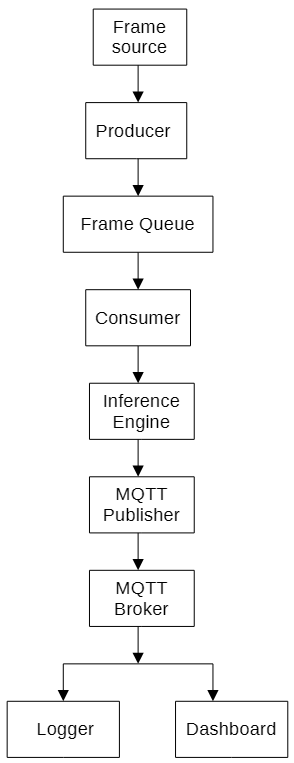
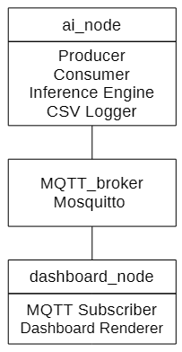
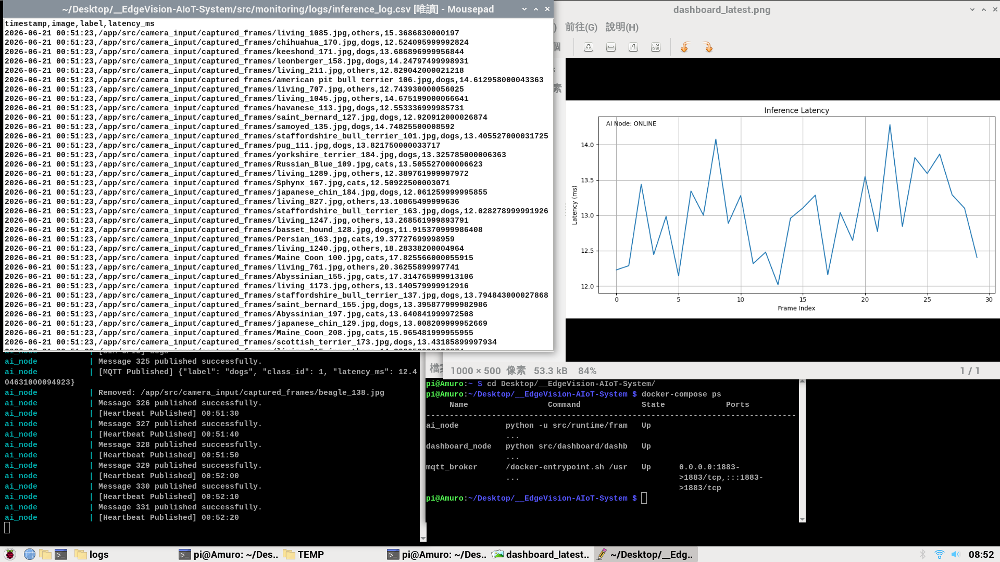

# EdgeVision-AIoT-System

## Project Overview

EdgeVision-AIoT-System is a containerized Edge AI runtime designed for deployment on resource-constrained devices such as Raspberry Pi.

The project explores how AI inference, device communication, monitoring, and deployment can be integrated into a resilient AIoT runtime.

Starting from a monolithic image classification script, the system evolved into a multi-service architecture featuring:

* Docker Compose deployment
* MQTT-based event-driven communication
* Producer–Consumer queue processing
* Runtime observability and monitoring
* Graceful shutdown and recovery mechanisms
* Raspberry Pi edge deployment

The primary engineering focus of this project is runtime resilience under real-world operating conditions rather than model accuracy alone.


## System Architecture



## Runtime Pipeline

1. Frames are collected from the input source.
2. Producer threads enqueue frames into a bounded queue.
3. Consumer threads retrieve frames for inference.
4. Inference results are logged locally and published through MQTT.
5. Dashboard services subscribe to MQTT events for visualization.
6. Monitoring components track runtime health through heartbeat messages and telemetry logs.

The bounded queue acts as a backpressure mechanism, preventing uncontrolled memory growth during burst traffic conditions.


## Deployment Diagram



## Dashboard Screenshot



## Raspberry Pi Deployment Photo


## Reliability Validation

Validation Environment:
- Raspberry Pi 5
- Docker Compose deployment
- MQTT event transport
- 322-image burst workload

| Test Item               | Result     |
| ----------------------- | ---------- |
| Burst Workload          | 322 Images |
| Data Loss               | 0          |
| Queue Deadlock          | 0          |
| Graceful Shutdown       | Passed     |
| MQTT Reconnect Recovery | Passed     |
| Dashboard Update        | Passed     |
| CSV Logging             | Passed     |

The runtime was validated using a 322-image burst workload to evaluate queue behavior, graceful shutdown handling, and end-to-end data integrity.

No frame loss, queue deadlock, or data corruption was observed during testing.

# System Evolution

| Phase | Transformation | Achievements (Outcome)  | Status |
|-------|-------------------------|----------------|--------|
| **Phase 0 — Modularized Edge AI** | From **single Python inference script** → **modular Edge AI application** | - Modular AI inference architecture<br>- Monitoring layer abstraction<br>- Action layer abstraction<br>- Hardware-independent design<br>- Reusable inference pipeline  | Completed |
| **Phase 1 — Containerized Edge AI** | From **modular Edge AI application** → **containerized AIoT platform prototype** | - Dockerized deployment<br>- MQTT-based service communication<br>- Multi-service runtime architecture<br>- Publish-subscribe messaging<br>- Multi-service orchestration  | Completed |
| **Phase 2 — Resilient Edge AI** | From **containerized AIoT platform prototype demonstration** → **hardened, resilient, production-ready Edge AIoT system architecture** | Stress-tested with 322-image burst workload:<br>- Complete edge runtime stabilization with 100% data integrity under multi-threaded load<br>- Fully functional blocking backpressure handling via bounded queue<br>- Deterministic, zero-data-loss graceful shutdown and workspace draining<br>- Resilient background monitoring with automatic socket restoration and telemetry heartbeats  | Completed |
| **Phase 3 - Edge AI Deploymenet** | From resilient edge AI to production-ready AIoT System | - Edge AI deployment<br>- Real-time camera pipeline (planned)  | 3A completed<br> 3B planned |


## Technology Stack

| Category      | Technologies                          |
| ------------- | ------------------------------------- |
| AI Inference  | TensorFlow Lite                       |
| Runtime Engineering | Python, Multithreading, Producer-Consumer Queue |
| Messaging     | MQTT, Mosquitto                       |
| Deployment    | Docker, Docker Compose                |
| Edge Platform | Raspberry Pi 5                        |
| Monitoring    | CSV Logging, Dashboard Visualization  |

## Repository Structure
```txt
EdgeVision-AIoT-System/
│
├── docker-compose.yml
│
├── deployment/
│   │
│   ├── ai_node/
│   │   ├── Dockerfile
│   │   └── requirements.txt
│   │
│   ├── dashboard_node/
│   │   ├── Dockerfile
│   │   └── requirements.txt
│   │
│   └── mosquitto/
│       └── mosquitto.conf
│
├── docs/
├── architecture/
│
└── src/
    │
    ├── inference_core.py
    │
    ├── models/
    │   └── pet_classifier_fp16.tflite
    │
    ├── dashboard/
    │   └── dashboard_subscriber.py
    │
    ├── action_layer/
    │   ├── gpio_controller.py
    │   └── action_router.py
    │
    ├── camera_input/
    │   ├── captured_frames/
    │   └── webcam_capture.py
    │
    ├── monitoring/
    │   ├── dashboard/
    │   │   └── dashboard_latest.png
    │   │
    │   ├── logs/
    │   │   └── inference_log.csv
    │   │
    │   └── logger.py
    │
    ├── communication/
    │   ├── mqtt_publisher.py
    │   └── mqtt_subscriber.py
    │
    └── runtime/
        ├── frame_to_inference.py
        ├── frame_queue.py
        ├── producer.py
        └── consumer.py
```

## Documentation

```txt   
docs/
├── phases/
│   ├── phase0_modularied_edge_ai.md
│   ├── phase1_containerization.md
│   ├── phase2_robustness.md
│   └── phase3A_deployment_retrospective.md
│
├── architecture/
│   ├── initial_architecture.md
│   ├── modularization.md
│   ├── multi_node_design.md
│   └── communication_flow.md
│
├── debugging/
│   ├── queue_draining_and_duplicate_enqueue_analysis.md
│   ├── mqtt_connection_refused.md
│   ├── tensorflow_container_warning.md
│   └── python_package_resolution.md
│
├── deployment/
│   ├── docker_setup.md
│   ├── mqtt_setup.md
│   ├── runtime_validation.md
│   └── phase3A_rpi5_deployment.md
│
└── lessons_learned/
    ├── why_package_structure_matters.md
    ├── docker_context_vs_copy.md
    ├── service_boundary_design.md
    ├── threaded runtime introduced race condition.md
    ├── runtime architecture upgrade.md
    ├── docker_relative_path_pitfalls.md
    ├── docker_volume_mapping_debugging.md
    ├── mqtt_tls_configuration_conflict.md
    └── TensorFlow_to_TFLite_migration.md
```


### Future roadmap
Phase 3B – Real-Time Camera Pipeline
- Replace file-based frame loading with live camera input
- Support continuous edge vision processing

Phase 3C – Service Integration
- Linux systemd integration
- Automatic startup and recovery

Phase 3D – Long-Duration Validation
- 24–72 hour runtime testing
- Resource utilization monitoring
- Stability validation under continuous operation
